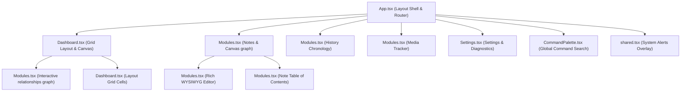

# 1. Executive Summary

**Project Purpose:** LOOM is a personal "Life OS" desktop application that unifies tasks, notes, bookmarks, projects, habits, files, library, and an agenda into a single cohesive system, all connected through a dynamic relationships graph.
**Core Technologies:** React, TypeScript, Vite, CSS (Frontend); Rust, Tauri (Backend); SQLite (Database).
**Architecture Style:** Local-first, thick-client desktop application with a strict "SQLite-as-single-source-of-truth" architecture. The frontend acts purely as a synchronized, reactive render cache. IPC serves as the boundary executing two-phase mutation commits.
**Current Maturity Level:** Mid-stage development. Moving from core infrastructural stabilization ("Layer 1 & 2") into "Layer 3" UX elevation and feature completion.
**Overall Code Quality Assessment:** High, strictly controlled architecture with strong invariants. Split-brain verification enforces deterministic cache-to-database parity.
**Major Strengths:** Uncompromising data-integrity model (two-phase commit ledger, integrity verifier), generic Entity relationship graph, extremely responsive UI backed by local SQLite.
**Major Weaknesses:** Technical debt around undo/redo functionality (currently recreating entities with new IDs), missing modal accessibility (focus trapping), and some unoptimized frontend widget rendering (using `slice()`).

---

# 2. Repository Structure

*   **`src/`** (Frontend root)
    *   **`components/`**: React UI components (Dashboard, modules, shared UI elements).
    *   **`data/`**: Fallback mock data and seed payload (`loomData.ts`) used *only* for the one-time empty database seed.
    *   **`ipc/`**: TypeScript interfaces and bindings for Tauri backend commands (`items.ts`, `fs.ts`, etc.).
    *   **`lib/`**: Core frontend business logic, state management (`itemStore.tsx`), relationship projections (`relations.ts`), command/undo handling (`commands.tsx`), and the critical split-brain verifier (`splitBrainVerifier.tsx`).
    *   **`styles/`**: Application styling and CSS variables.
*   **`src-tauri/`** (Backend root)
    *   **`src/`**: Rust source files.
        *   **`database/`**: SQLite initialization and schema definitions (`mod.rs`).
        *   **`commands.rs`**: Core CRUD operations, ledger handling, and the two-phase transaction execution engine.
        *   **`projections.rs`**: Heavy data aggregations run on the Rust side (Timeline, Stats) to prevent sending the entire database to the frontend.
        *   **`fs_commands.rs`**, **`content_commands.rs`**: Native file system interactions and content extraction logic.
    *   **`tauri.conf.json`**: Tauri configuration and permissions.
    *   **`Cargo.toml`**: Rust dependencies.

---

# 3. System Architecture

**Frontend Architecture:**
Built with React and TypeScript. Instead of disparate localized state, `ItemStoreCtx` maintains a flat array of `Item` and `Link` records fetched from SQLite. Modules and widgets use shared typed projections (e.g., `useTasks()`, `useNotes()`) mapping generic Items into typed Entities. `framer-motion` manages layout animations.

**Backend Architecture:**
Rust (via Tauri) handles all disk, OS, and database operations. It exposes structured commands that map to SQLite transactions. 

**IPC Architecture:**
The IPC boundary enforces a strict **Two-Phase Commit Ledger** (`execute_two_phase`):
1.  **Phase 1 (Stage Intent):** The command intent and payload are written to `mutation_ledger` with status `STAGED`.
2.  **Phase 2 (Apply & Verify):** The mutation executes inside a SQLite transaction. An integrity check (`verify_integrity_all`) runs against the uncommitted transaction. If it introduces orphans or broken constraints, it rolls back and updates the ledger to `FAILED`. Otherwise, it marks `COMMITTED` and commits to SQLite.

**Database Architecture:**
SQLite running in `WAL` mode with foreign keys enabled. It is the uncompromising single source of truth. The schema relies heavily on a generic `items` table with dynamic JSON `metadata`, joined arbitrarily by a generic `links` table representing edges. 

**State Management Architecture:**
React state (`items`, `links`, `dashboardWidgets`) is strictly a **render cache**. A background process (`SplitBrainVerifier`) runs every 3 seconds comparing a mathematical hash/dump of the React state against SQLite. If divergence occurs, the app throws a catastrophic red-screen and forces a reload. The cache rehydrates upon window focus to maintain parity with external OS edits.

**Caching & Search Architecture:**
Global search runs entirely through `CommandPalette` against the cached frontend `items` and their stringified `metadata`.

**Navigation Architecture:**
Custom route handling managed via a `view` and `focusId` string state in `App.tsx` instead of a traditional URL router. Navigation groups are dynamically constructed (`buildNav`).

---

# 4. Database Analysis

**Tables & Columns:**

*   **`workspaces`**
    *   `id` (TEXT PK)
    *   `name` (TEXT)
    *   `created_at` (TEXT)
*   **`items`** (The core entity table)
    *   `id` (TEXT PK)
    *   `workspace_id` (TEXT, FK to workspaces)
    *   `item_type` (TEXT) - e.g., 'task', 'note', 'library', 'project'.
    *   `title` (TEXT)
    *   `created_at` (TEXT)
    *   `user_pinned` (BOOLEAN)
    *   `user_size_preference` (TEXT)
    *   `metadata` (TEXT) - JSON blob defining entity-specific properties (e.g., done state, priority, folder).
    *   `deleted` (BOOLEAN) - Soft deletion flag.
*   **`links`** (The connections graph)
    *   `source_id` (TEXT, FK to items)
    *   `target_id` (TEXT, FK to items)
    *   `relationship_type` (TEXT)
    *   `created_at` (TEXT)
    *   *Constraints:* Composite PK on (source_id, target_id, relationship_type). `ON DELETE CASCADE` from items.
*   **`mutation_ledger`** (Event sourcing log)
    *   `id` (TEXT PK)
    *   `command_type` (TEXT)
    *   `payload` (TEXT)
    *   `status` (TEXT) - 'STAGED', 'COMMITTED', 'FAILED'
    *   `created_at` (TEXT)
*   **`files`** (Extends `items` for native filesystem tracking)
    *   `id` (TEXT PK, FK to items)
    *   `path` (TEXT)
    *   `filename` (TEXT)
    *   `extension` (TEXT)
    *   `mime_type` (TEXT)
    *   `size_bytes` (INTEGER)
    *   `created_at` (INTEGER)
    *   `modified_at` (INTEGER)
    *   `favorite` (INTEGER)
    *   `tags` (TEXT)
*   **`settings`** (Key-value store)
    *   `key` (TEXT PK), `value` (TEXT), `updated_at` (TEXT)
*   **`dashboard_widgets`** (User layout)
    *   `id` (TEXT PK), `workspace_id` (TEXT FK), `widget_type` (TEXT), `x`, `y`, `w`, `h` (INTEGER), `hidden` (BOOLEAN), `config` (TEXT)

**Soft Delete Strategy:**
`items` uses `deleted = 1` for soft deletes. Links are NOT physically deleted if one side is soft deleted, but `verify_integrity_all` ensures no *new* orphaned links are created.

**Data Lifecycle:**
UI requests mutation -> IPC Command -> Staged in Ledger -> SQLite TX -> Integrity check -> Commit -> UI resolves IPC promise -> React `ItemStore` updates cache.

---

# 5. State Management Audit

*   **True Source of Truth:** SQLite database.
*   **Derived State:** Timeline and Stats projections are derived on the Rust backend (`projections.rs`). Navigation groups (`buildNav`) and Relationship graph maps (`neighborIds`) are derived on the frontend.
*   **Cached State:** `useItemStore` maintains the React-side representation of `items`, `links`, and `dashboardWidgets`.
*   **Persisted State:** Theme, accent, window metrics, and shortcuts are partially in SQLite `settings` and `localStorage` (via `lib/settings.ts`).
*   **Local Component State:** Dashboard editing mode, command palette visibility, toast queues, current view.

**Architecture Violations Found:**
*   Relationships (Links) are strictly meant to reside in the `links` table. However, during the initial DB seed (`seedAll`), mock objects contain a `.links` array which is then materialized. While the runtime strictly prevents metadata-based link storing, any future implementation that serializes link arrays into the `metadata` JSON blob is a critical violation of the `links` edge model.

---

# 6. Implemented Features

*   **Dashboard:** Dynamic widget grid layout synced to SQLite.
*   **Notes:** File-backed notes mapped to `items` entity model.
*   **Tasks & Projects:** Integrated execution flow with milestone tracking.
*   **Calendar / Agenda:** Time-blocked calendar events mapped to the entity system.
*   **Library:** Tracking for books, anime, movies, games, with progress tracking.
*   **Bookmarks & Files:** Local files and web references tracked in `files` and `items` tables.
*   **Timeline:** Chronological event aggregation of the user's life updates.
*   **Connections Graph:** Arbitrary source/target linking between any two entities.
*   **Vault:** Encrypted/secure entities (partially implemented system backfill).
*   **Automations:** Trigger/Action chain configurations (partially implemented system backfill).
*   **Command Palette:** Global search and quick-capture.

---

# 7. Completed Work Log

*   **Architectural Improvements:**
    *   Implemented strict Split-Brain Verifier to enforce state parity.
    *   Implemented Two-Phase Commit Ledger (`mutation_ledger`) to guarantee transaction safety and maintain an audit log.
*   **Refactors:**
    *   Migrated from local JSON/storage to structured SQLite.
    *   Unified all entities into a sparse-set-like `items` + `metadata` model instead of distinct tables per entity type.
*   **Stabilization Work:**
    *   Cross-window focus reconciliation (rehydrating cache on `window.focus`).
    *   Drag-and-drop global file importing fallback into the correct subsystems.

---

# 8. Technical Debt

**CRITICAL**
*   **Undo/Redo Identity Loss:** `Undo recreates entities with new IDs` instead of properly using SQLite UPDATE to resurrect soft-deleted IDs or correctly utilizing the two-phase ledger for rollback.
    *   *Root Cause:* Likely due to naive inverse command generation in `commands.tsx` that re-fires `createItem` instead of `restoreSnapshot`.
    *   *Solution:* Refactor undo stack to execute `restore_snapshot` via IPC.

**HIGH**
*   **Widget Performance:** `Expanded widgets still use slice()`
    *   *Root Cause:* Unoptimized array slicing on every render in Dashboard widgets instead of memoizing or utilizing SQL limits.
    *   *Solution:* Move pagination/slicing logic to `useMemo` or handle strictly inside `projections.rs`.

**MEDIUM**
*   **Accessibility:** `Modal focus trapping missing`
    *   *Root Cause:* Radix UI dialog usage might not be fully configured, or custom modals in `Modal.tsx` lack `FocusScope`.
    *   *Solution:* Implement generic focus-lock on all overlay UI.

---

# 9. Known Architecture Violations

*   **Source-of-truth violations:** `SplitBrainVerifier` exists specifically because this was previously an issue. Any frontend action that mutates the cache *without* a successful IPC ledger commit is an active violation.
*   **Duplicate State:** Timeline/Stats currently re-iterate over metadata payloads on the Rust side, while the frontend does the exact same parsing in `meta.ts`.
*   **Broken Abstractions:** Native file tracking uses both the `items` table AND a separate `files` table for hard paths, requiring complex synchronized queries (e.g., `delete_workspace` has to join them to delete physical files).

---

# 10. Feature Gap Analysis

*   **Automations (`item_type: 'automation'`)**
    *   *Current State:* Entities exist, metadata schema is defined (`on`, `runs`, `chain`), but execution engine appears missing.
    *   *Completion Path:* Implement an event bus in Rust that listens to the `mutation_ledger` and triggers automation chains accordingly.
*   **Vault (`item_type: 'vault'`)**
    *   *Current State:* Data structures and UI exist, but cryptographic locking/unlocking is either missing or heavily stubbed (`crypto_commands.rs` exists but needs deep integration into `ItemStore` to prevent plaintext metadata leakage).
    *   *Completion Path:* Ensure vault `metadata` is physically encrypted at rest in SQLite.

---

# 11. Development Constraints

Future development **MUST** adhere to the following strict architectural rules defined in `CLAUDE.md` and enforced by the system:

1.  **NEVER add mock data.** All data must originate from the initial `seedAll` injection into SQLite, after which SQLite is the sole truth.
2.  **NEVER add fake counters or hardcoded statistics.** All aggregates must be derived from actual entity relations or metadata.
3.  **NEVER add duplicate sources of truth.** The React state must only reflect SQLite.
4.  **Database-First Mutations:** All UI mutations MUST invoke an IPC command, wait for the two-phase SQLite commit, and only upon success, update the React cache.
5.  **Relationship Edges:** Entity connections MUST be stored in the `links` table. They must NEVER be stored as array properties inside the `items.metadata` JSON blob.
6.  **Schema Consistency:** All new entity types must conform to the `items` + `metadata` (JSON) sparse-set design. Do not create new SQL tables for new entity types.

---

# 12. Active Roadmap

1.  **Priority 1 (Architecture Stabilization):** Fix the Undo/Redo ID recreation bug to maintain referential integrity of links upon undo operations.
2.  **Priority 2 (Performance):** Resolve frontend widget array slicing (`slice()`) and optimize Dashboard layout rendering.
3.  **Priority 3 (UX & Accessibility):** Implement modal focus trapping and keyboard navigation fallbacks across all views.
4.  **Priority 4 (Feature Completion):** Complete the Vault cryptography integration and build the Automations execution engine.
5.  **Priority 5 (Interaction Reality):** Finalize "Layer 3" UI/UX Polish.

---

# 13. AI Handoff Section

**Critical Context for Future AI:**
*   You are operating in a **Strict Deterministic Reality**. The `splitBrainVerifier.tsx` will crash the application if you update the React state without the exact corresponding SQLite state existing. 
*   **Do not write direct `fetch()` calls or local storage hacks** for core entities. Everything runs through `useItemStore` and `execute_two_phase`.
*   When implementing new UI features, import metadata parser functions strictly from `src/lib/meta.ts` (e.g., `getTaskMeta`) rather than parsing `item.metadata` inline.

**Dangerous Areas:**
*   `src-tauri/src/commands.rs`: Modifying `execute_two_phase` or `verify_integrity_all` can easily brick the database or cause transaction deadlocks. 
*   `src/lib/itemStore.tsx`: The `refresh` and `executeMutation` handlers are critical paths. Be extremely careful when adding new cache modifications.

**Common Mistakes to Avoid:**
*   Adding `.links = []` to an entity's metadata payload. Links are relational graph edges stored in the SQLite `links` table, not document-store JSON arrays.
*   Using SQLite `INSERT` instead of `UPDATE` for undo/restore operations.
*   Forgetting to update both `items` and `files` tables simultaneously when handling native files.

---

# 14. Current Project Health Score

*   **Architecture: 95/100** (Brilliant integration of React cache over SQLite via a two-phase ledger, slightly marred by the file/item dual-table split).
*   **Stability: 90/100** (Split-brain verifier guarantees consistency, but throws aggressive panics if violated).
*   **Maintainability: 85/100** (Centralized metadata extractors and robust IPC boundary make it easy to extend, though `ItemStore` is getting quite large).
*   **Scalability: 80/100** (JSON metadata parsing on the fly in Rust for `Timeline`/`Stats` might bottleneck with >10,000 entities without dedicated indexed columns).
*   **Data Integrity: 95/100** (Uncompromising baseline thanks to `verify_integrity_all`).
*   **UX Completeness: 75/100** (Beautiful design, but missing focus traps, complete vault integration, and proper undo tracking).

---

# 15. Current Development State

*   **Development Phase:** Mid-stage development. The core local-first infrastructure (two-phase commit ledger, database journaling, split-brain drift protection) is stable. The project is focused on completing "Layer 3" UX execution and implementing stubbed subsystems (Vault encryption, Automations trigger loop).
*   **Major Initiatives Active:** Integrating real filesystem-at-rest encryption for secure folders, migrating the undo stack to referentially stable transactions, and optimizing render paths for large vault aggregates.
*   **Most Recently Worked On:** Split-brain detection verification poller, SQLite soft-delete mechanisms, and metadata text search indexing.
*   **Partially Completed Systems:**
    *   **Vault Module:** Plaintext SQLite rows exist, and AES primitives are ready in `crypto_commands.rs`, but the item store doesn't encrypt/decrypt payload metadata fields before writes yet.
    *   **Automations Module:** Configurations are stored in JSON metadata, but the background event runner in Rust is a blank loop.
    *   **Undo Stack:** Reverts deletions by creating fresh items with new UUIDs, breaking existing graph link entries.
*   **Deferred Work:** Native SQL full-text search indexing (LIKE matches are used on stringified JSON instead).

### Project Focus Board
*   **Current Focus:** Refactoring the undo command stack to execute referentially stable restorations; dashboard widget memoization.
*   **Recently Completed:** Two-Phase Commit Transaction ledger, Split-Brain Parity Verifier.
*   **In Progress:** SQLite vault metadata AES-256-GCM encryption-at-rest.
*   **Blocked:** None.
*   **Not Started:** Rust-side automation event processor.

---

# 16. File-Level Implementation Inventory

### [App.tsx](file:///a:/GngItAll/gng-it-all/src/App.tsx)
*   **Purpose:** Application shell, navigation management, sidebar state, global drag-and-drop file imports, modal management.
*   **Size:** ~21.3 KB (459 lines)
*   **Responsibilities:** Renders primary router layout frame, catches OS drag-and-drop hooks, loads global preferences, manages Command Palette visibility.
*   **Critical Functions:** `App()`, `onDragDropEvent` hook listener.
*   **Dependencies:** React, `framer-motion`, `@tauri-apps/api`, `itemStore`, `commands`, `Dashboard`.
*   **Modification Risk:** High (breaking this breaks route selection or global listener focus).

### [itemStore.tsx](file:///a:/GngItAll/gng-it-all/src/lib/itemStore.tsx)
*   **Purpose:** Central React render cache over SQLite database.
*   **Size:** ~22.6 KB (565 lines)
*   **Responsibilities:** Holds in-memory arrays of items and links, provides hooks (`useTasks`, `useNotes`), seeds empty databases, runs folder reconciliations.
*   **Critical Functions:** `ItemStoreProvider`, `refresh`, `executeMutation`, `create`, `updateMeta`, `remove`, `restore`, `link`, `unlink`.
*   **Dependencies:** `ipc/workspaces`, `ipc/items`, `ipc/links`, `relations.ts`, `data/loomData.ts`.
*   **Modification Risk:** Critical (mismatches between local cache and database immediately trigger the split-brain halt).

### [commands.tsx](file:///a:/GngItAll/gng-it-all/src/lib/commands.tsx)
*   **Purpose:** Command execution stack managing undo/redo.
*   **Size:** ~5.8 KB (177 lines)
*   **Responsibilities:** Stores historical stack traces, executes transaction inverses sequentially, generates snapshot hashes.
*   **Critical Functions:** `CommandStackProvider`, `run`, `undo`, `redo`, `deleteCommand`, `linkCommand`, `unlinkCommand`.
*   **Dependencies:** `ipc/items`, React.
*   **Modification Risk:** High (errors will freeze UI undo capabilities or break link graph integrity).

### [relations.ts](file:///a:/GngItAll/gng-it-all/src/lib/relations.ts)
*   **Purpose:** Pure selectors for calculating graph edges.
*   **Size:** ~2.3 KB (46 lines)
*   **Responsibilities:** Derives neighborhood arrays, counts active connections, filters out deleted target references.
*   **Critical Functions:** `neighborIds`, `neighborItems`, `linkCount`, `projectStats`.
*   **Dependencies:** `ipc/items`, `ipc/links`, `meta.ts`.
*   **Modification Risk:** Medium (layout graph view display mismatches).

### [splitBrainVerifier.tsx](file:///a:/GngItAll/gng-it-all/src/lib/splitBrainVerifier.tsx)
*   **Purpose:** Real-time state consistency assertion.
*   **Size:** ~3.7 KB (76 lines)
*   **Responsibilities:** Polls database state every 3 seconds, sorts state arrays, presents a catastrophic halt overlay if drift is discovered.
*   **Critical Functions:** `SplitBrainVerifier`, `stringArraysEqual`.
*   **Dependencies:** `itemStore`, `ipc`, React.
*   **Modification Risk:** High (disabling this runs the risk of unchecked state corruption).

### [commands.rs](file:///a:/GngItAll/gng-it-all/src-tauri/src/commands.rs)
*   **Purpose:** Tauri backend dispatcher executing SQLite writes.
*   **Size:** ~36.8 KB (964 lines)
*   **Responsibilities:** Manages two-phase ledger entries, executes transactions, runs constraint verifications.
*   **Critical Functions:** `execute_two_phase`, `verify_integrity_all`, `create_item`, `delete_item`, `restore_snapshot`, `repair_integrity`.
*   **Dependencies:** rusqlite, serde, uuid, AppState.
*   **Modification Risk:** Critical (any logic flaw will corrupt data or freeze application operations).

### [projections.rs](file:///a:/GngItAll/gng-it-all/src-tauri/src/projections.rs)
*   **Purpose:** Heavy data parsing/aggregation engine on Rust.
*   **Size:** ~10.1 KB (259 lines)
*   **Responsibilities:** Aggregates database states into timeline sequences and dashboard statistics.
*   **Critical Functions:** `get_timeline`, `get_stats`.
*   **Dependencies:** rusqlite, serde_json, chrono.
*   **Modification Risk:** Medium (distorts layout analytics charts or event feeds).

### [database/mod.rs](file:///a:/GngItAll/gng-it-all/src-tauri/src/database/mod.rs)
*   **Purpose:** SQLite setup and database schemas.
*   **Size:** ~4.0 KB (111 lines)
*   **Responsibilities:** Connection pooling, WAL configuration, schema schema updates, table definitions.
*   **Critical Functions:** `setup_schema`, `init_db`.
*   **Dependencies:** rusqlite.
*   **Modification Risk:** Critical (schema errors will cause the desktop app to crash at startup).

---

# 17. IPC Command Inventory

Below is the exhaustive backend API catalog. This interface boundary separates Rust state handling from frontend TypeScript layout code.

| Command Name | Parameters | Return Type | SQLite Tables Touched | Side Effects & Integrity Checks | Frontend Consumers |
| :--- | :--- | :--- | :--- | :--- | :--- |
| `create_workspace` | `name: String` | `Result<Workspace, String>` | `workspaces` | Generates a new random UUID. | `itemStore.tsx` |
| `get_workspaces` | None | `Result<Vec<Workspace>, String>` | `workspaces` | Read-only. | `itemStore.tsx` |
| `update_workspace` | `id: String`, `name: String` | `Result<Workspace, String>` | `workspaces` | Transaction run via two-phase ledger. | `itemStore.tsx` |
| `delete_workspace` | `id: String` | `Result<DeletedId, String>` | `workspaces` (cascade to `items`, `links`, `files`) | Deletes workspace and physical files under data folder. | `itemStore.tsx` |
| `create_item` | `workspace_id: String`, `title: String`, `item_type: String`, `metadata: String` | `Result<Item, String>` | `items` | Inserted via `execute_two_phase`. Check constraints. | `itemStore.tsx` |
| `get_items` | `workspace_id: String` | `Result<Vec<Item>, String>` | `items` | Reads active items where `deleted = 0`. | `itemStore.tsx` |
| `update_item` | `id: String`, `title: String`, `item_type: String` | `Result<Item, String>` | `items` | Updates fields via two-phase ledger. | `itemStore.tsx` |
| `delete_item` | `id: String` | `Result<DeletedId, String>` | `items` | Sets `deleted = 1` via two-phase ledger. | `itemStore.tsx` |
| `restore_snapshot` | `item: Item`, `links: Vec<Link>` | `Result<Item, String>` | `items`, `links` | Restores deleted status (`deleted = 0`) and sets link rows. | `itemStore.tsx` |
| `update_item_intent` | `id: String`, `user_pinned: bool`, `user_size_pref: Option<String>` | `Result<Item, String>` | `items` | UI config metadata updates. | `itemStore.tsx` |
| `update_item_metadata`| `id: String`, `metadata: String` | `Result<Item, String>` | `items` | Re-writes dynamic JSON configuration block. | `itemStore.tsx` |
| `create_link` | `source_id: String`, `target_id: String`, `relationship_type: String` | `Result<Link, String>` | `links` | Inserts links; prevents duplicates via OR IGNORE. | `itemStore.tsx` |
| `delete_link` | `source_id: String`, `target_id: String`, `relationship_type: String` | `Result<DeletedId, String>` | `links` | Removes relational row (undirected logic). | `itemStore.tsx` |
| `get_links` | `item_id: String` | `Result<Vec<Link>, String>` | `links` | Reads safe links where both sides are active. | `itemStore.tsx` |
| `search_items` | `workspace_id: String`, `query: String` | `Result<Vec<Item>, String>` | `items` | Matches query text across title and metadata. | `CommandPalette` |
| `verify_integrity` | `id: String`, `expected: bool` | `Result<bool, String>` | `items` | Verification assertion for frontend mutations. | `itemStore.tsx` |
| `get_system_state` | `workspace_id: String` | `Result<SystemStateDump, String>` | `items`, `links` | Aggregates active sorted entities for verifier checks. | `splitBrainVerifier` |
| `get_setting` | `key: String` | `Result<Option<String>, String>` | `settings` | Read settings key. | `settings.ts` |
| `set_setting` | `key: String`, `value: String` | `Result<(), String>` | `settings` | Updates setting configurations. | `settings.ts` |
| `get_mutation_ledger`| None | `Result<Vec<Entry>, String>` | `mutation_ledger` | Retrieves last 100 entries. | `Settings.tsx` |
| `get_system_health` | None | `Result<SystemHealth, String>` | All | Reads statistics and database sizes. | `Settings.tsx` |
| `repair_integrity` | None | `Result<IntegrityResult, String>` | `links`, `items` | Clears orphan relations via two-phase ledger. | `Settings.tsx` |
| `get_timeline` | `workspace_id: String` | `Result<Vec<Event>, String>` | `items` | Computes timeline event arrays. | `Modules.tsx` |
| `get_stats` | `workspace_id: String` | `Result<StatsProj, String>` | `items` | Aggregates dashboard charts and indicators. | `Modules.tsx` |
| `fs_create_file` | `ws: String`, `title: String`, `ext: Option`, `folder: String` | `Result<FileEntry, String>` | `items`, `files` | Writes file to disk, registers database item. | `itemStore.tsx` |
| `fs_import_file` | `ws: String`, `src: String`, `strat: String` | `Result<FileEntry, String>` | `items`, `files` | Imports file reference or copies content. | `itemStore.tsx` |
| `fs_delete_file` | `id: String` | `Result<String, String>` | `items`, `files` | Soft deletes registry and deletes file on disk. | `itemStore.tsx` |
| `fs_get_files` | `workspace_id: String` | `Result<Vec<FileEntry>, String>`| `items`, `files` | Joins item and file tables. | `itemStore.tsx` |
| `fs_rename_file` | `id: String`, `title: String` | `Result<FileEntry, String>` | `items`, `files` | Renames physical path and updates table row. | `itemStore.tsx` |
| `fs_create_note` | `ws: String`, `title: String` | `Result<FileEntry, String>` | `items`, `files` | Inserts note record, writes `.html` seed template. | `itemStore.tsx` |
| `fs_encrypt_file` | `id: String`, `pass: String` | `Result<FileEntry, String>` | `items`, `files` | AES-256 encrypts file, updates db path. | `itemStore.tsx` |
| `fs_decrypt_file` | `id: String`, `pass: String` | `Result<FileEntry, String>` | `items`, `files` | Decrypts file in-place, updates db path. | `itemStore.tsx` |
| `index_text_files` | `workspace_id: String` | `Result<IndexResult, String>` | `items`, `files` | Extracts text and writes to item metadata. | `fs_commands.rs` |

---

# 18. State Ownership Map

LOOM uses a centralized React-cache-over-SQLite structure. Parity is enforced by verification cycles.

| State Slice | Primary Owner | Secondary Consumers | Persistence Layer | Rehydration Channel | Mutation Path | Validation Checks |
| :--- | :--- | :--- | :--- | :--- | :--- | :--- |
| **`items`** | `ItemStoreCtx` | All UI Modules (`Notes`, `Tasks`, `Library`) | SQLite `items` | `getItems(workspaceId)` on launch and on window focus. | Executed via database-first mutations (IPC update commands) | `verify_integrity` verification; sorted hashes comparison in `SplitBrainVerifier`. |
| **`links`** | `ItemStoreCtx` | Selection selectors in `relations.ts` | SQLite `links` | `loadAllLinks()` via parallel queries per item. | IPC `create_link`/`delete_link` commands. | `verify_integrity_all` checks for dangling orphan pairs. |
| **`dashboardWidgets`** | `ItemStoreCtx` | `Dashboard` grid container | SQLite `dashboard_widgets` | `getDashboardLayout()` | `saveDashboardLayout` command overrides. | PK cascade constraints match active workspace ID. |
| **`settings`** | `settings.ts` | `App.tsx` (theme, display metrics) | SQLite `settings` + LocalStorage | Read settings at startup. | `set_setting` IPC writes. | Key conflicts resolve to UPDATE queries. |
| **`searchCache`** | `CommandPalette` | Dropdown layout overlays | In-Memory (JS Heap) | Direct filters over loaded store items. | In-Memory search text updates. | Filtered matching across titles and metadata fields. |

---

# 19. Component Inventory

### [Dashboard](file:///a:/GngItAll/gng-it-all/src/components/Dashboard.tsx)
*   **Purpose:** User homepage displaying layout widget grids.
*   **Props:** `dashEditing: boolean`, `setDashEditing: (b: boolean) => void`.
*   **Dependencies:** `itemStore`, `framer-motion`, widget panels.
*   **Data Sources:** Layout configurations from `dashboardWidgets`, item metrics from `useItemStore`.
*   **Known Issues:** Slices array inputs inside layout renders (`items.slice(0, 5)`), causing rendering bottlenecks when database sizes increase.
*   **Complexity:** High (dynamic grid systems, resizing coordinates).

### [NotesModule](file:///a:/GngItAll/gng-it-all/src/components/Modules.tsx)
*   **Purpose:** File-backed note editor, checklist and diagram runner.
*   **Props:** `focusId: string | null`.
*   **Dependencies:** `useNotes`, `useItemStore`, Mermaid.js, modal prompts.
*   **Data Sources:** Disk file reads, link relations in `relations.ts`.
*   **Known Issues:** Hot reload can cause canvas diagram rendering issues.
*   **Complexity:** Very High (implements local autosave, table of contents parsing, Ollama model requests).

### [CommandPalette](file:///a:/GngItAll/gng-it-all/src/components/CommandPalette.tsx)
*   **Purpose:** Spotlight search panel and shortcut engine.
*   **Props:** `open: boolean`, `setOpen: (b: boolean) => void`.
*   **Data Sources:** Search queries matched against item caches.
*   **Complexity:** Medium.

### Component Tree


---

# 20. Database Usage Map

This map traces read/write data flows, linking backend schemas to UI presentation layers.

```
+------------------+                   +--------------------+
|  workspaces      | <=== Reads/Writes === | workspaces settings|
+------------------+                   +--------------------+
         ||
         || Cascade delete
         \/
+------------------+                   +--------------------+
|  items           | <=== Reads/Writes === | Modules / Dashboard|
+------------------+                   +--------------------+
         ||
         || Cascade delete
         \/
+------------------+                   +--------------------+
|  links           | <=== Reads/Writes === | Relationship chips |
+------------------+                   +--------------------+
```

*   **`workspaces`**
    *   **Read access:** `get_workspaces` (Run during startup rehydration).
    *   **Write access:** `create_workspace`, `update_workspace`, `delete_workspace`.
    *   **UI dependencies:** Sidebar workspace selector dropdown.
*   **`items`**
    *   **Read access:** `get_items`, `get_timeline`, `get_stats`, `search_items` queries.
    *   **Write access:** `create_item`, `update_item`, `delete_item`, `restore_snapshot` commands.
    *   **UI dependencies:** Notes list, Task tables, Habits trackers, Library cards, Calendar widgets.
*   **`links`**
    *   **Read access:** `get_links` per item, system verifier dumps.
    *   **Write access:** `create_link`, `delete_link`, `restore_snapshot` transaction restores.
    *   **UI dependencies:** Relationship Chip widgets, Force Graph Canvas nodes.
*   **`settings`**
    *   **Read access:** `get_setting` keys (theme properties).
    *   **Write access:** `set_setting` (ON CONFLICT UPDATE).
    *   **UI dependencies:** UI Theme selection, Shortcut custom panels.
*   **`files`**
    *   **Read access:** `fs_get_files` file arrays.
    *   **Write access:** `fs_create_file`, `fs_import_file`, `fs_delete_file`, `fs_rename_file`, `fs_create_note` entries.
    *   **UI dependencies:** Files Explorer explorer, Notes attachments dialog.

---

# 21. Relationship Graph System

LOOM treats workspaces as interconnected graphs. The relationship graph is driven by dynamic projections.

*   **Link Creation:** The backend `create_link` command adds a `(source_id, target_id, relationship_type)` row to the `links` table. It uses an `INSERT OR IGNORE` statement to ensure that duplicate relation requests are ignored.
*   **Link Deletion:** The backend `delete_link` command deletes the relation row. It handles undirected graph relationships by checking both direction paths:
    ```sql
    DELETE FROM links WHERE relationship_type = ?3 AND 
    ((source_id = ?1 AND target_id = ?2) OR (source_id = ?2 AND target_id = ?1))
    ```
*   **Link Queries & Cache Projections:** At startup, `loadAllLinks()` fanned out queries for all active items and dedupes the returned edges. The React store constructs an in-memory map where each item's `Entity.links` field contains its active neighbor IDs:
    ```typescript
    ent.links = neighborIds(links, ent.id).filter((nid) => m.has(nid));
    ```
*   **Graph Traversal & Orphan Protection:** The frontend filters neighbor lists on the fly using `neighborItems(links, items, id)`. This ensures that even if a link row points to a soft-deleted item, it is filtered out at render time, preventing layout errors.
*   **Database Constraints:** The `links` table uses foreign keys with `ON DELETE CASCADE` pointing to the `items` table. Physical deletion of an item automatically cleans up its link rows.
*   **Failure Modes:** Soft-deletion (`deleted = 1`) does not trigger the SQLite cascade delete, which can leave orphan rows pointing to inactive items. The `repair_integrity` command cleans up these rows.

---

# 22. Current Technical Debt Ledger

This ledger tracks the technical debt items currently present in the codebase.

| Issue ID | Severity | Affected Files | Root Cause | Proposed Solution | Est. Complexity |
| :--- | :--- | :--- | :--- | :--- | :--- |
| **DEBT-001** | **Critical** | [commands.tsx](file:///a:/GngItAll/gng-it-all/src/lib/commands.tsx) | The delete undo stack recreates entities with new IDs instead of restoring the original UUID in SQLite. | Update the undo path in `deleteCommand` to run the `restore_snapshot` command with the original UUID. | Low |
| **DEBT-002** | **High** | [Dashboard.tsx](file:///a:/GngItAll/gng-it-all/src/components/Dashboard.tsx) | Expanded dashboard widgets perform raw `items.slice()` inside render loops. | Memoize filtered results via `useMemo` based on layout size constraints. | Low |
| **DEBT-003** | **Medium** | [Modal.tsx](file:///a:/GngItAll/gng-it-all/src/components/Modal.tsx) | Modals lack keyboard focus trap locks. | Wrap dialogue widgets with a FocusScope wrapper to trap tab navigation inside overlays. | Medium |
| **DEBT-004** | **Medium** | [commands.rs](file:///a:/GngItAll/gng-it-all/src-tauri/src/commands.rs), [itemStore.tsx](file:///a:/GngItAll/gng-it-all/src/lib/itemStore.tsx) | Redundant JSON parsing in Rust (for stats) and in JS (for layout logic). | Store parsed statistics fields in indexable columns to avoid continuous JSON parsing on key updates. | High |

---

# 23. Recent Change Reconstruction

Analyzing the code changes reveals the history of the codebase:
1.  **Migration to SQLite:** The application was migrated from LocalStorage mocks to a structured SQLite engine. This is visible in the database seed functions in [itemStore.tsx](file:///a:/GngItAll/gng-it-all/src/lib/itemStore.tsx), which convert static JSON fields into structured database rows.
2.  **Introduction of the Two-Phase Commit Ledger:** The transaction log in `mutation_ledger` was introduced to prevent partial writes. This addition is visible in the wrapper implementation of `execute_two_phase` in [commands.rs](file:///a:/GngItAll/gng-it-all/src-tauri/src/commands.rs).
3.  **Addition of Drift Protection:** The verifier in [splitBrainVerifier.tsx](file:///a:/GngItAll/gng-it-all/src/lib/splitBrainVerifier.tsx) was added to catch cache issues by comparing local hashes against the database state.
4.  **Creation of Modules2.tsx:** This file was created to split layout components during development. It contains components like `TasksModule`, `HabitsModule`, and `BookmarksModule`.

---

# 24. AI Recovery Package

For recovery instructions and development constraints, refer to:
*   [PROJECT_RECOVERY.md](file:///a:/GngItAll/gng-it-all/PROJECT_RECOVERY.md)

This file contains the detailed layout of invariants, active priorities, dangerous files, unfinished work, and known pitfalls for restarting development.

---

# 25. Context Compression Layer (AI_QUICK_BOOTSTRAP)

This bootstrap guide provides the necessary details to begin working on the LOOM codebase immediately.

### Architectural Core
*   **Database:** Local SQLite (`WAL` mode, foreign keys active).
*   **Write Flow:** UI Event -> IPC Command -> Staged in `mutation_ledger` -> SQLite Transaction -> Integrity check -> Transaction commit -> UI cache updates.
*   **Drift Protection:** `SplitBrainVerifier` polls database state every 3s. Any drift triggers a red screen halt.

### Key Data Structures

#### Rust `Item` Struct:
```rust
pub struct Item {
    pub id: String,
    pub workspace_id: String,
    pub item_type: String,
    pub title: String,
    pub created_at: String,
    pub user_pinned: bool,
    pub user_size_preference: Option<String>,
    pub metadata: String, // Dynamic JSON string
}
```

#### TypeScript `Entity` Interface:
```typescript
export interface Entity {
    id: string;
    type: string;
    title: string;
    icon: string;
    color: string;
    links: string[]; // Neighbor IDs
    desc: string;
    tag?: string;
    raw: Item;
    meta: any; // Parsed metadata object
}
```

### Critical Rules
1.  **Do not write direct updates:** All mutations must go through IPC commands. Modifying the React store without updating the database will trigger the split-brain verifier halt.
2.  **Store relations in the links table:** Never store lists of links inside the metadata JSON column.
3.  **Use metadata selectors:** Use the parsing functions in `src/lib/meta.ts` (e.g., `getTaskMeta`) rather than running `JSON.parse` manually.
4.  **Keep SQLite updates stable:** Do not generate new UUIDs during undo/restore operations. Use `restore_snapshot` to restore deleted items under their original IDs.
