<p align="center">
  
</p>

<h1 align="center">Loom</h1>
<p align="center"><b>A personal operating system for your life.</b><br/>Offline. Private. Fast.</p>

<p align="center">
  
  
  
  
  
</p>

---

Loom keeps your whole life in one place — tasks, notes, projects, habits, books, files, bookmarks, calendar events — and connects them together so you can actually see how everything relates.

No subscription. No cloud. No account. Everything lives in a local SQLite database on your machine. Close the lid, open it on a plane, it still works.

<p align="center">
  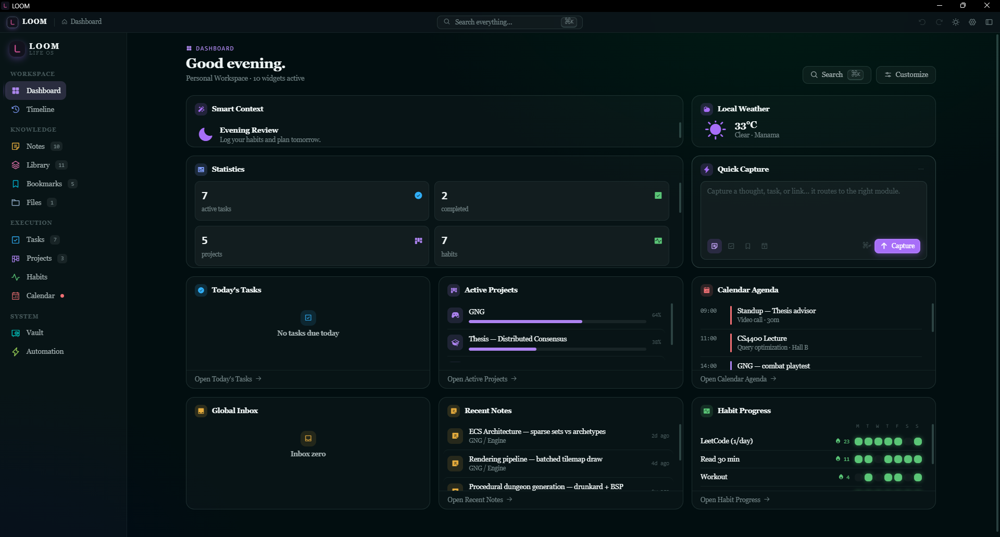
</p>

<p align="center"><sub>A configurable dashboard. Every widget pulls live data — nothing is mocked.</sub></p>

---

## Contents

- [Install](#install) · [Build from source](#build-from-source)
- [What it does](#what-it-does)
- [Tech decisions](#tech-decisions) · [Architecture](#architecture)
- [Project layout](#project-layout) · [Hardening highlights](#hardening-highlights)

---

## Install

Loom ships as a standard Windows installer. Download the latest release, run it, and launch from the Start menu — no Node, no Rust, no terminal required.

The build produces **two installer formats**. Pick whichever you prefer:

| File | Type | Use it if… |
|---|---|---|
| `Loom_0.1.0_x64-setup.exe` | NSIS installer | You want the normal "Next → Next → Finish" wizard. **Recommended.** |
| `Loom_0.1.0_x64_en-US.msi` | Windows Installer (MSI) | You deploy via Group Policy / `msiexec`, or prefer MSI for IT-managed machines. |

### Using the `.exe` (NSIS) installer

1. Double-click `Loom_0.1.0_x64-setup.exe`.
2. If Windows SmartScreen appears (the app isn't code-signed yet), click **More info → Run anyway**.
3. Choose an install location and click through the wizard.
4. Launch **Loom** from the Start menu or the desktop shortcut.

### Using the `.msi` installer

```powershell
# Interactive
msiexec /i Loom_0.1.0_x64_en-US.msi

# Silent (no UI) — useful for managed deployment
msiexec /i Loom_0.1.0_x64_en-US.msi /quiet
```

### First launch

Loom creates its SQLite database under your user app-data folder on first run and seeds a demo workspace so you have something to explore. Everything is local — to start fresh, just clear the workspace from **Settings → Data**.

> **Uninstall** — Settings → Apps, or run the MSI with `msiexec /x`. Your data folder is left in place unless you remove it manually.

---

## What it does

### Dashboard

A configurable workspace that shows you exactly what you decide matters right now. Drag and resize widgets. Every widget pulls live data — your open tasks, today's agenda, active projects, reading progress.

<p align="center">
  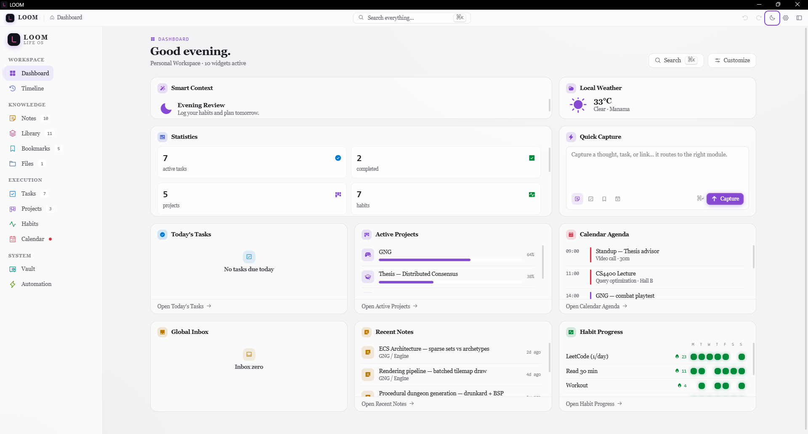
</p>
<p align="center"><sub>Same dashboard, light theme. Ten built-in themes, live accent-color picker.</sub></p>

### Notes

A folder-based knowledge base with a live markdown editor, split preview, and full-text search across everything you've written.

<p align="center">
  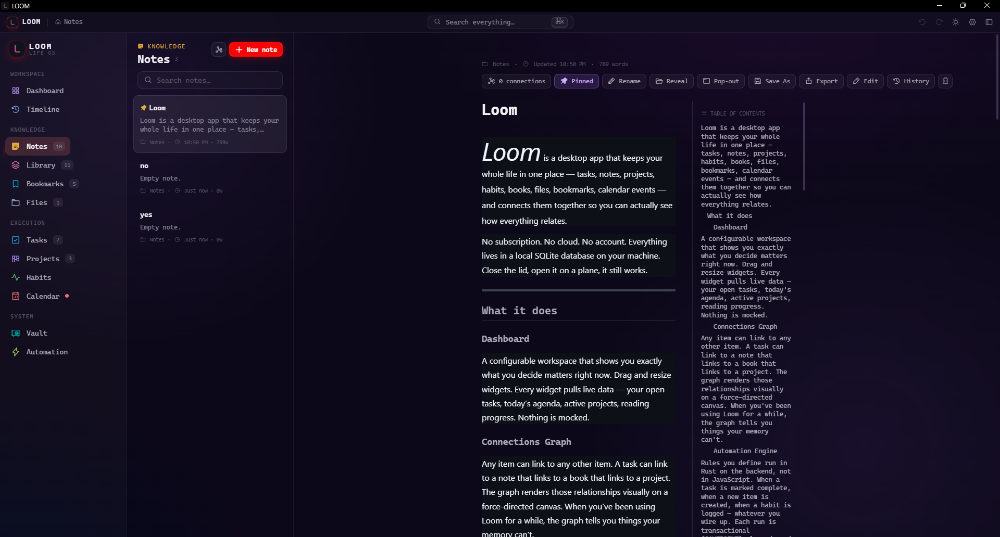
</p>

### Automation Engine

Rules you define run in **Rust on the backend**, not in JavaScript. When a task is marked complete, when a new item is created, when a habit is logged — whatever you wire up. Each run is transactional (`SAVEPOINT`), logged, and recoverable after a crash.

<p align="center">
  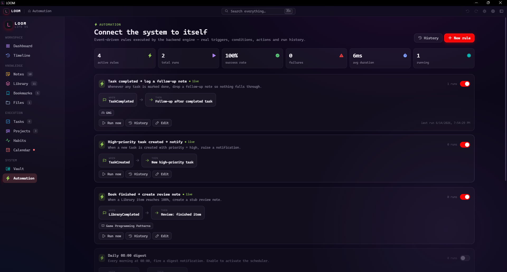
</p>

<table>
  <tr>
    <td width="50%">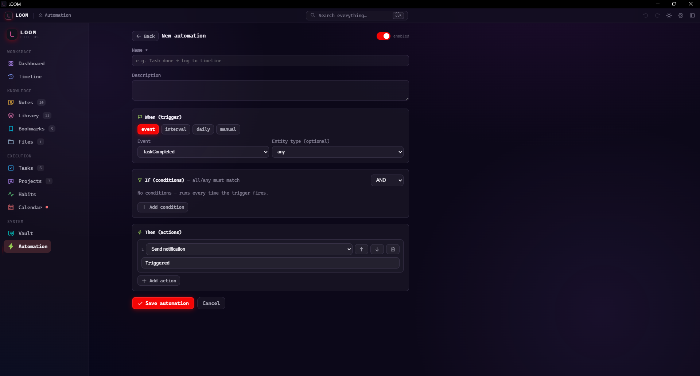</td>
    <td width="50%">
      <b>Trigger → Condition → Action.</b><br/><br/>
      Pick an event (task completed, item created, habit logged), add optional conditions, then chain actions. The engine evaluates rules on its own thread with its own database connection — it never blocks the UI.
    </td>
  </tr>
</table>

### Vault

Encrypt files and secrets at rest using **AES-256-GCM** with **Argon2** key derivation. The vault tracks every in-flight operation in SQLite, so if the process dies mid-write, the next startup heals it. No half-encrypted files, no orphaned records.

<p align="center">
  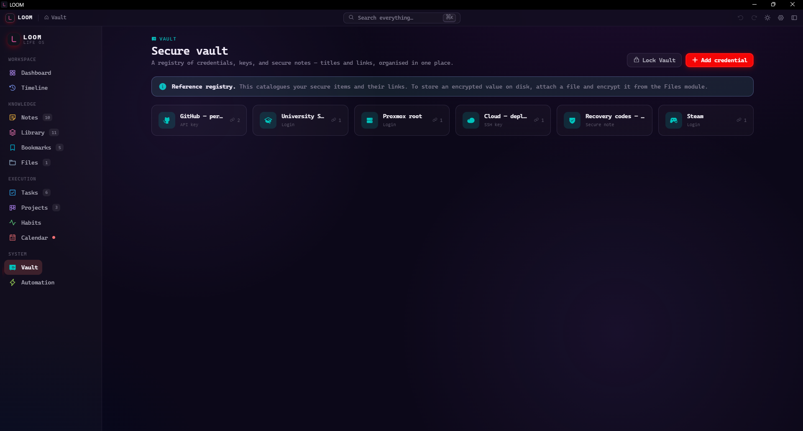
</p>

### Tasks · Projects · Habits · Calendar

<table>
  <tr>
    <td width="50%">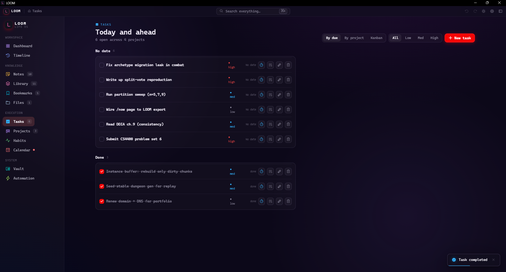</td>
    <td width="50%">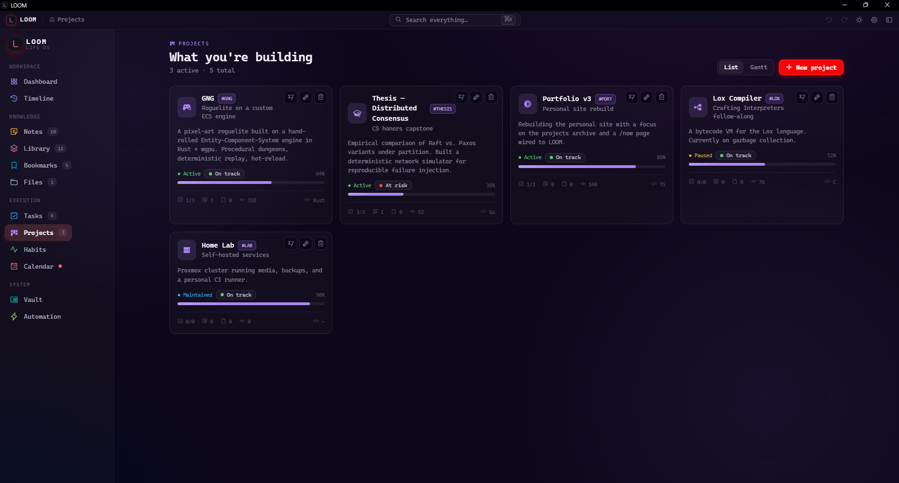</td>
  </tr>
  <tr>
    <td align="center"><sub>Tasks — priorities, due dates, grouping by due/project/kanban</sub></td>
    <td align="center"><sub>Projects — milestones, progress, linked tasks &amp; notes</sub></td>
  </tr>
  <tr>
    <td width="50%">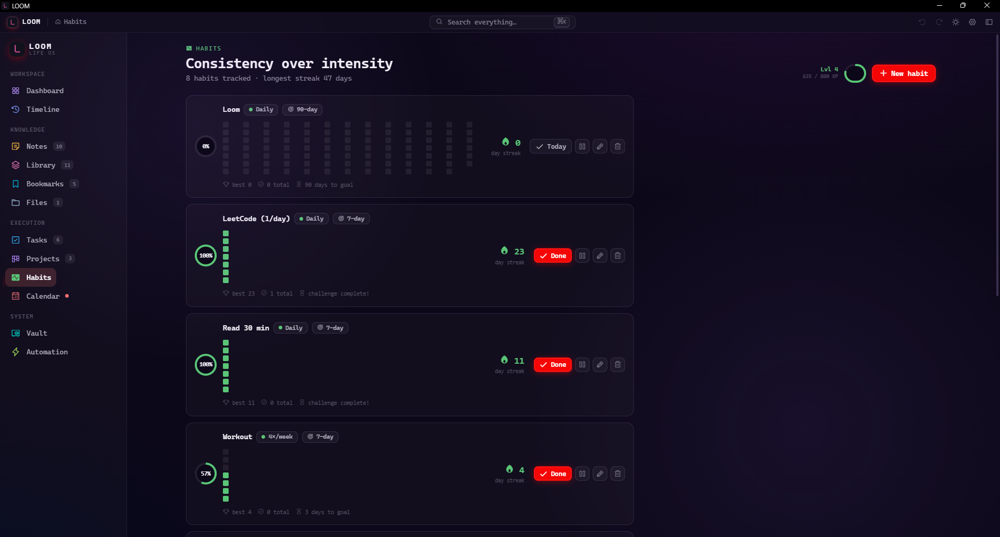</td>
    <td width="50%">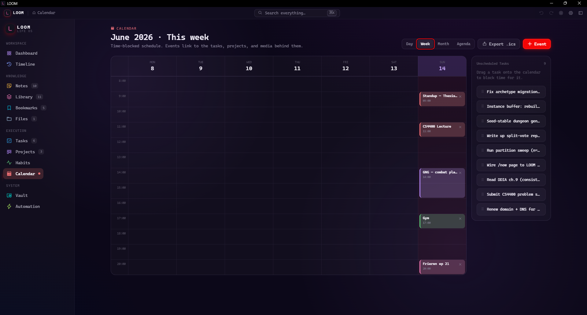</td>
  </tr>
  <tr>
    <td align="center"><sub>Habits — streaks, heatmaps, daily/weekly cadence</sub></td>
    <td align="center"><sub>Calendar — time-blocked events linked to your items</sub></td>
  </tr>
</table>

### Timeline

A single chronological stream of everything across every module — notes, tasks, projects, books, events, habits, files, bookmarks — one scrollable history of your life.

<p align="center">
  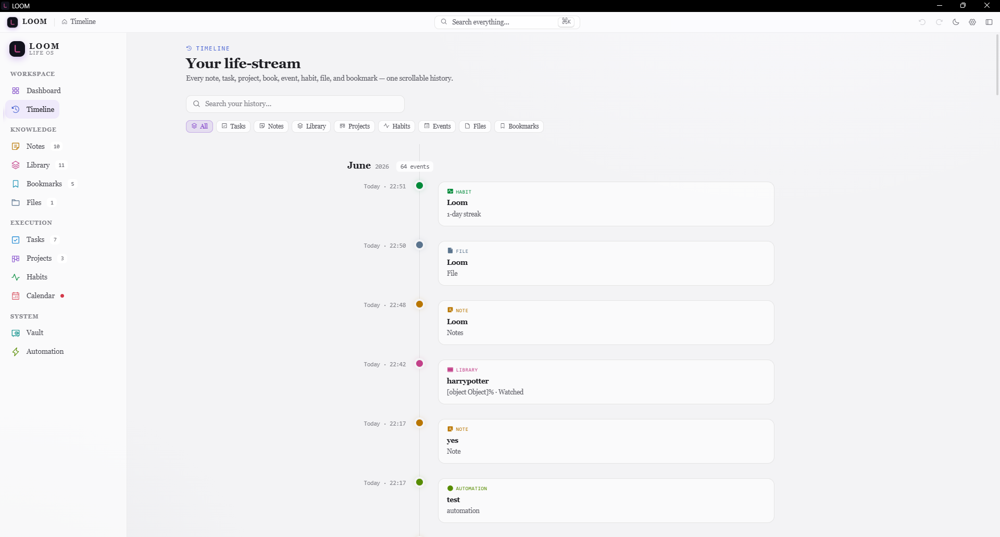
</p>

### Connections Graph

Any item can link to any other item. A task links to a note that links to a book that links to a project. Loom renders those relationships on a force-directed canvas, so the graph tells you things your memory can't.

### And the rest

- **Library** — books, shows, anime, games with per-item progress
- **Bookmarks** — save URLs with metadata, tags, and connections
- **Files** — attach and manage local files with vault encryption
- **Command palette** — `⌘K` / `Ctrl K` to jump anywhere, run any action, search everything

---

## Tech decisions

| Layer | Choice | Why |
|---|---|---|
| Shell | Tauri 2 | ~5 MB binary. Native webview. No Chromium bundled. |
| Backend | Rust | Memory safe. No GC pauses. The automation engine runs on its own thread with its own SQLite connection so it never blocks the UI mutex. |
| Database | SQLite + WAL | Offline first. ACID. Sub-millisecond reads. WAL lets the engine write without locking the main connection. |
| Frontend state | Zustand + event sourcing | The backend emits `loom://event` on every mutation. The store applies it like a reducer. UI stays consistent with the database without polling. |
| Lists | `@tanstack/react-virtual` | Tested to 50,000 items. Only visible rows render. |
| ViewModel layer | Pure functions | Every screen gets one assembled projection from `createXViewModel()`. No component fetches its own data. `UI = f(ViewModel)`. |

---

## Architecture

```
┌─────────────────────────────────────────────────┐
│                    React UI                      │
│   Components consume ViewModels, nothing else    │
├─────────────────────────────────────────────────┤
│              Zustand Item Store                  │
│   Event-sourced cache. loom://event keeps it     │
│   in sync with SQLite without polling.           │
├────────────────────┬────────────────────────────┤
│    Tauri IPC       │    Automation Engine        │
│    Commands        │    (own thread, own conn)   │
├────────────────────┴────────────────────────────┤
│              SQLite — WAL mode                   │
│   items · links · workspaces · automation_rules  │
│   automation_executions · pending_fs_ops         │
└─────────────────────────────────────────────────┘
```

The automation engine runs on its own OS thread with its own database connection. WAL mode allows concurrent readers and one writer — the engine writes without acquiring the IPC mutex. Engine-originated mutations don't emit events back into the engine (anti-storm guard). If a run is interrupted, `recover_interrupted()` resets it on next startup.

The `pending_fs_ops` table tracks every file mutation between the disk write and the database commit. If the process is killed in that window, `recover_pending_fs_ops()` replays or rolls back. Item IDs and links survive.

---

## Build from source

### Prerequisites

- [Node.js](https://nodejs.org/) 18+
- [Rust](https://rustup.rs/) + Cargo
- [Tauri prerequisites](https://tauri.app/start/prerequisites/) for your OS

### Run in development

```bash
npm install
npm run tauri dev
```

### Build the installers

```bash
npm run tauri build
```

The installers land in `src-tauri/target/release/bundle/`:

```
bundle/
  nsis/  Loom_0.1.0_x64-setup.exe     # NSIS installer (recommended)
  msi/   Loom_0.1.0_x64_en-US.msi     # Windows Installer
```

---

## Project layout

```
src/
  components/      # React screens and widgets
  lib/
    viewmodels.ts  # Pure ViewModel constructors — one per screen
    itemStore.tsx  # Zustand store, event-sourced via loom://event
    meta.ts        # Typed metadata accessors for every item type
    relations.ts   # Adjacency graph, neighbor queries, link counts
    actions.ts     # Single typed action registry (palette, keyboard)
    automation/    # Frontend automation rule builder
src-tauri/
  src/
    commands.rs        # IPC command handlers, two-phase writes
    automation.rs      # Event engine — triggers, conditions, actions
    projections.rs     # Timeline and stats aggregations over SQLite
    fs_commands.rs     # File ops with pending_fs_ops crash recovery
    database/mod.rs    # Schema, migrations, WAL setup, backup logic
    crypto_commands.rs # AES-256-GCM vault encryption
public/
  phosphor/          # Bundled icon fonts (no CDN dependency, works offline)
docs/
  screenshots/       # Images used in this README
```

---

## Hardening highlights

These aren't features — they're invariants the codebase enforces:

- **No startup panic** — path handling uses `to_string_lossy()`, not `unwrap()`; WAL pragmas run before the schema transaction, never inside it.
- **Two-phase writes** — every mutation goes through `execute_two_phase()`, which wraps the operation in a `SAVEPOINT` and verifies integrity before commit.
- **Crash recovery** — three independent systems run on startup: `recover_interrupted()` for automation, `recover_pending_fs_ops()` for vault ops, and `verify_integrity_all()` + `fs_reconcile()` for orphaned records.
- **No stale closures** — React effects use functional updaters where reading stale state would break keyboard navigation.
- **Offline by construction** — icon fonts are bundled locally; the app never blocks on a network request to render.
- **Scale** — chunked IPC pagination, virtualized rendering, and SQLite projection queries for aggregations (no JS reduce over 100k rows).

---

## License

MIT
